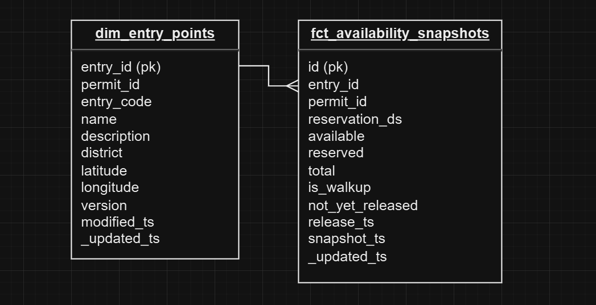
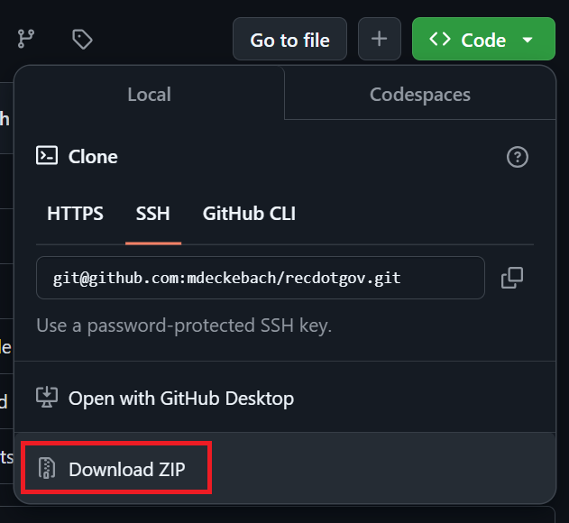
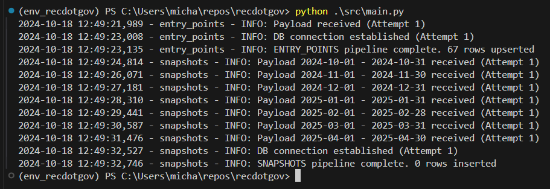

# Recreation.gov Data Pipeline

## Overview
This project implements an ETL pipeline that pulls backcountry permit availability data from [Recreation.gov](https://www.recreation.gov) and writes it to a database for later analysis.

## Goals
My original goal was to build something that can systematically pull backpacking permit data (starting with just Inyo National Forest, as that's what I care most about) from [Recreation.gov](https://www.recreation.gov). I wanted to take that data and build a database of permit availability snapshots, so that I can track how permits are bought up and released over time.

In the process, I hoped to learn:
- How to pull data from the web, ideally via API and not webscraping
- How to set up a database on my Synology NAS that I could write to
- How to write data to a database via automated script
- How to host and schedule the script to run on a schedule via my NAS
- Improved my Python skills

## Files
- `src/main.py` - This is the main driver script to run the pipeline. It triggers the extract, transform, and load processes for all permit availability data and metadata. This is what should be called to run the script.
- `src/entry_points.py` - A module that contains functions to extract, transform, and load entry_point (trailhead) metadata like the permit's name, location, and description. It essentially creates a dimensional table containing attributes of an entry point, `dim_entry_points`. Every time this pipeline is run, the entire table gets rewritten.
- `src/snapshots.py` - A module that contains functions to extract, transform, and load availability data for each entry_point. It upserts records to a main fact table, `fct_availability_snapshots`. To save on storage, only entry_points that have changed since the latest record in the database get an additional record added. When scheduled frequently enough, this means the table is something of a running ledger of changes, though it is possible for multiple changes to happen between runs. You can think of it is a sort of "type 2 slowly-changing fact table."
- `src/setup_logger.py` - Contains the formatting for logging, which was important for this project as it is my first time building a script to schedule on my NAS, so I want to be able to understand run history and performance.
- `src/sql.py` - Contains SQL queries used by `src/entry_points.py` and `src/snapshots.py`, stored as strings.
- `.env` - Contains global variables, including database configuration details. See below for details on how to edit this to run the project on your own machine. **You will need to create this file for the script to run**. An example structure is laid out in `.env.example`.
- `requirements.txt` - Contains a list of all packages that need to be installed for the script to work (i.e., dependencies)
- `\docs\` - A space to store documentation files, like flowchart and ERD images
- `\logs\` - A space for the log files that the script generates

## Pipeline Architecture


### Source Data: Recreation.gov
I started by looking for a public API and found [RIDB API](https://ridb.recreation.gov/docs), which was super promising. However, the `/reservations` endpoint appears to no longer function, so I hit a dead end.

Then, I did a bit of poking around the Inyo Backcountry Permit webpage using developer tools, wondering if maybe I would find any calls that might contain the necessary data. Somehow, availability is getting to the webpage! I got the idea from [this article](https://emery-44439.medium.com/how-find-openings-in-rec-gov-campsites-using-dart-and-aws-lambda-9bfe3fe29369), which was doing something similar with campsite avilability.

Inspecting [the webpage](https://www.recreation.gov/permits/233262), I combed through the network traffic and found two promising API calls:

1. https://www.recreation.gov/api/permitinyo/233262/availabilityv2?start_date=2024-09-01&end_date=2024-09-30&commercial_acct=false - Bingo! This is the what we're looking for! Only problem is that the entry points are listed using some sort of key instead of their actual name. I'd need something else to map between these entry point ids and a human-readable name.

2. https://www.recreation.gov/api/permitcontent/233262 - This second endpoint appears to contain all the metadata for a given area. The `233262` in the URL is the id for Inyo National Forest. Combing through the data, I see that ['payload']['divisions'] contains the mapping I need to get from entry point ids to names!

While neither of these API endpoints are publicly documented as far as I can tell, I can use them to get the data I need in a programmatic way.

### Synology NAS
My home server is providing all the compute, storage, and scheduling for this project. Synology makes things super easy with built in packages. I used:

- `Docker` - For containerization of my script and all dependencies
- `MariaDB` - For data storage. I won't include instructions for doing this here, but [this video](https://www.youtube.com/watch?v=4bLr3fuZO4Q) was super helpful.
- `Synology Task Scheduler` - For scheduling the script to run every 15 minutes

I didn't want to pay for storage or compute, so using Synology's built-in services was an easy way to accomplish my goals with minimum complexity.

### Entity Relationship Diagram



`fct_availability_snapshots` only containing change data instead of full snapshots was a design decision I made to save on storage. To start, I am tracking just Inyo National Forest, which contains 67 permitted entry points. I also plan to run my script every 15 minutes. Thus, 1 year's worth of script-running with full snapshots each run would be:

67 entry points x 215 permit days/run x 365 days/year x 24 hrs/day x 4 runs/hr = ~500M rows

Given that the *vast* majority of those records would just be redundant/identical, some napkin math shows that just recording changes from previous run would be:

67 entry points x 365 days/yr x 20 changes per entry-point-date = ~500K rows

Obviously, this assumes an average of 20 changes per entry point + date, but it drops data storage by orders of magnitude.

## Prerequisites

Directions or anything needed before running the project.

- Prerequisite 1
- Prerequisite 2
- Prerequisite 3

## How to Run This Project

### A. To run from the Command Line
#### Requirements
- Python 3+ (I used 3.12.5 in development)
- A database and user with read/write permissions. I used [MariaDB](https://mariadb.org/). You can follow [these instructions](https://www.youtube.com/watch?v=4bLr3fuZO4Q) to setup on a Synology NAS, or just install and setup a user locally on your machine. You will need the following information about your database:
    -`host` (could be your local host if using a DB setup locally)
    - `database` (the name of the database)
    - `user`
    - `password`

#### Instructions
1. Download this repository to your local machine.

2. Unzip the file and navigate to the location of the unzipped project.
3. Copy `.env.example` to `.env` (or just change the file name so that it is `.env`). Fill out the following variables with your info: `host`, `user`, `password`, `database`.
4. Install all requirements by running:
```
pip install -r requirements.txt
```
4. Run the program:
```
python src\main.py
``` 
If setup correctly, you should see logging write to the terminal like so:


### B. To run using Docker

Replace the example step-by-step instructions with your own.

1. Install x packages
2. Run command: `python x`
3. Make sure it's running properly by checking z
4. To clean up at the end, run script: `python cleanup.py`

## Lessons Learned

It's good to reflect on what you learned throughout the process of building this project. Here you might discuss what you would have done differently if you had more time/money/data. Did you end up choosing the right tools or would you try something else next time?

## Contact

Please feel free to contact me if you have any questions at: LinkedIn, Twitter
