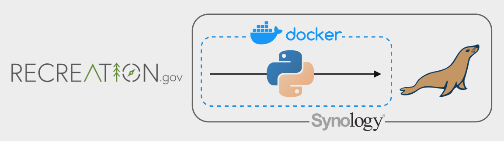

# Recreation.gov Data Pipeline

## Overview

The overall goal of this project is to build an ETL pipeline that I can schedule to automatically snapshot permit availability from https://recreation.gov.

Specific goals include:
- Get experience pulling data from an API
- Get experience writing data programatically to a database
- Get experience organizing a multi-file Python project, including separate modules, logging, and securely handling environmental variables
- Using Docker to containerize the project so it can be scheduled on my NAS

### Files
- `src/main.py` - A python script that contains the main executable to extract, transform, and load all permit availability data and metadata. This is what should be called to run the script.
- `src/entry_points.py` - A module that contains functions to extract, transform, and load entry_point (trailhead) metadata like the permit's name, location, and description. It essentially creates a dimensional table containing attributes of an entry point, `dim_entry_points`. Every time this pipeline is run, the entire table gets overwritten.
- `src/snapshots.py` - A module that contains functions to extract, transform, and load availability data for each entry_point. It upserts records to a main fact table, `fct_availability_snapshots`. To save on storage, only entry_points that have changed since the latest record in the database get an additional record added. When scheduled frequently enough, this means the table is something of a running ledger of changes, though it is possible for multiple changes to happen between runs. You can think of it is a sort of "type 2 slowly-changing fact table." 
- `src/setup_logger.py` - Contains the formatting for logging, which was important for this project as it is my first time building a script to schedule on my NAS, so I want to be able to understand run history and performance.
- `src/sql.py` - Contains SQL queries called by `src/entry_points.py` and `src/snapshots.py` as strings.
- `.env` - Contains global variables, including database configuration details. See below for details on how to edit this to run the project on your own machine.

### Pipeline Architecture

If you decide to include this, you should also talk a bit about why you chose the architecture and tools you did for this project.

### Entity Relationship Diagram

TODO: create an ERD showing the 2 end tables and their fields

## Prerequisites

Directions or anything needed before running the project.

- Prerequisite 1
- Prerequisite 2
- Prerequisite 3

## How to Run This Project

Replace the example step-by-step instructions with your own.

1. Install x packages
2. Run command: `python x`
3. Make sure it's running properly by checking z
4. To clean up at the end, run script: `python cleanup.py`

## Lessons Learned

It's good to reflect on what you learned throughout the process of building this project. Here you might discuss what you would have done differently if you had more time/money/data. Did you end up choosing the right tools or would you try something else next time?

## Contact

Please feel free to contact me if you have any questions at: LinkedIn, Twitter
